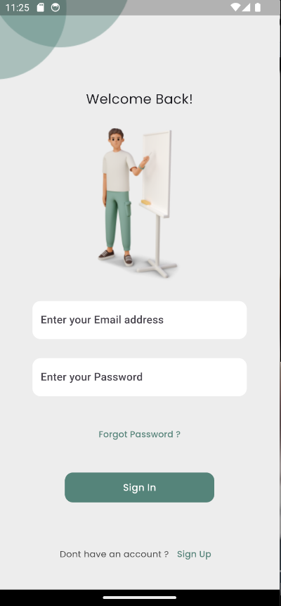
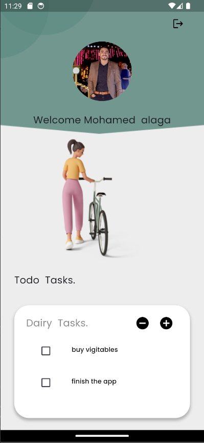
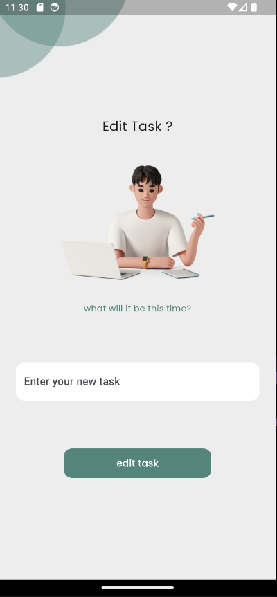

# ToDo List App


A simple and efficient ToDo List application built with Flutter, using Firebase for user authentication and remote data storage, and Hive for local data persistence. This app allows users to manage their tasks seamlessly across multiple devices.

## Features

- **User Authentication**: Secure user login and registration using Firebase Authentication.
- **Remote Data Storage**: Store and sync tasks across devices using Firebase Firestore.
- **Local Data Persistence**: Offline access to tasks using Hive as a local database.
- **Task Management**: Add, update, delete, and mark tasks as completed.
- **Responsive UI**: Clean and responsive user interface.
- **Reset Password Via Email**: user can reset the password using user email
- **State managment**: used Provider to handle state managment
- **Dialogs to Handle User Fault**: using dialogs to handleg errors and edge cases

## Screenshots






### Prerequisites

- Flutter SDK: [Install Flutter](https://flutter.dev/docs/get-started/install)
- Firebase Account: [Set up Firebase](https://firebase.google.com/)
- Hive: No external setup required.

### Dependencies

- cupertino_icons: ^1.0.8
- firebase_core: ^3.3.0
- firebase_auth: ^5.1.4
- hive_flutter: ^1.1.0
- hive_generator: ^2.0.1
- build_runner: ^2.4.12
- cloud_firestore: ^5.2.1
- provider: ^6.1.2
- flutter_launcher_icons: ^0.13.1
- flutter_native_splash: ^2.4.1
- awesome_dialog: ^3.2.1


### how to use

1. **Clone the Repository**
   ```bash
   git clone https://github.com/MohamedAlaga/TODO_list_flutter.git
   cd todo_list_app

2. **add your firebase**
- add the files

      /lib/firebase_options.dart

      /android/app/google-services.json

3. **run the app**
- open the project in the ide
- in termenal write 
   ```bash
  flutter pub get
  flutter run
  ```
### Authers

**Mohamed Alaga**
- [github](https://github.com/MohamedAlaga)
- [Linkedin](https://www.linkedin.com/in/mohamed-alaga-aab4a5246/)
